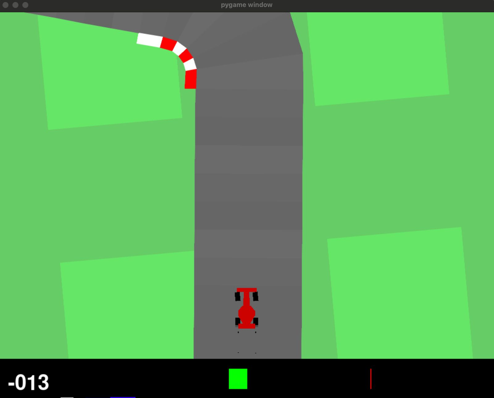

# Reinforcement Learning 



A collection of reinforcement learning implementations focused on training agents for various environments, including the Car Racing environment.

## 🚀 Setup

### Prerequisites

Use python version between 3.10 to 3.12

Before installation, ensure you have SWIG installed:

**macOS:**
```bash
brew install swig
```

**Windows:**
Follow the instructions at: https://open-box.readthedocs.io/en/latest/installation/install_swig.html

### Installation

1. Create and activate a virtual environment:
```bash
python3 -m venv rl
source rl/bin/activate  # On Windows: rl\Scripts\activate
```

2. Install dependencies:
```bash
pip install -r requirements.txt
pip install "ray[rllib]" torch
```

3. Set up environment variables:
```bash
cp .env.example .env
# Edit .env and add your WandB API key from https://wandb.ai/authorize
```

**Note:** The `.env` file contains your WandB API key for experiment tracking. Make sure to add `.env` to your `.gitignore` to keep your API key secure.

## 🎮 Usage

### Car Racing Environment

To get a feel for the environment you can play the game manually:
```bash
python car_racing_manual.py
```
Controls: W (accelerate), A/D (steer), S (brake), ESC/Q (quit)

Run the Car Racing simulation with random actions:
```bash
python car_racing_env.py
```

### Training Examples


**PPO on Car Racing:**
```bash
python RL-Baselines/train_ppo_car.py
```

**SAC on Car Racing:**
```bash
python RL-Baselines/train_sac_car.py
```

## 📂 Project Structure

```
├── 0.Learning/              # Learning materials and basic implementations
│   ├── Deep-Reinforcement-Learning-Notebooks/
│   ├── dqn_cartpole.py
│   ├── q_frozenlake.py
│   └── REINFORCE_lunar_landing.py
├── APPO/                    # APPO algorithm implementation
├── PPO/                     # PPO algorithm implementation
├── SAC/                     # SAC algorithm implementation
├── VPG/                     # Vanilla Policy Gradient
├── Reinforce/               # REINFORCE algorithm
├── RL-Baselines/            # Baseline implementations for benchmarking
├── assets/                  # GIFs and visualizations
├── data/                    # Saved models
└── car_racing_env.py        # Car Racing environment simulation
```

## 🧠 Algorithms To Be Implemented

- **REINFORCE**: Monte Carlo policy gradient
- **VPG (Vanilla Policy Gradient)**: Basic policy gradient method
- **PPO (Proximal Policy Optimization)**: State-of-the-art policy gradient
- **SAC (Soft Actor-Critic)**: Off-policy actor-critic algorithm
- **APPO (Asynchronous PPO)**: Distributed PPO variant
