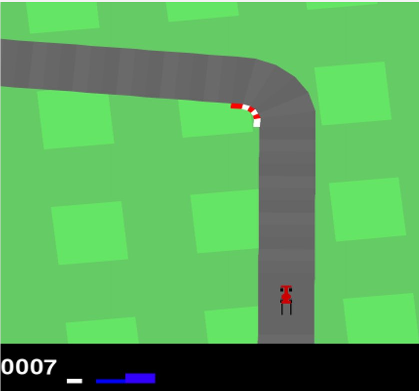

# Reinforcement Learning



A collection of reinforcement learning implementations focused on training agents for the CarRacing v3 environment from
the [farama Gym library](https://gymnasium.farama.org/#).

## Setup

### Prerequisites

Use python version between 3.10 to 3.12

Before installation, ensure you have SWIG
installed (used for [Box2D](https://gymnasium.farama.org/environments/box2d/)):

**macOS:**

```bash
brew install swig
```

**Windows:**
Follow the instructions at: https://open-box.readthedocs.io/en/latest/installation/install_swig.html

### Installation

1. Create and activate a virtual environment:

```bash
python3 -m venv .venv
source .venv/bin/activate  # On Windows: .venv\Scripts\activate
```

2. Install dependencies:

```bash
pip install -r requirements.txt
```

3. Set up environment variables:

```bash
cp .env.example .env
# Edit .env and add your WandB API key from https://wandb.ai/authorize
```

## Usage

### Car Racing Environment

To manually control the Car Racing environment, run:

```bash
python evaluation/car_racing_manual.py
```

Controls: W (accelerate), A/D (steer), S (brake), ESC/Q (quit)

Random Agent Evaluation:

```bash
python evaluation/car_racing_random.py
```

### Training Examples

**Train PPO Agent on Car Racing:**

```bash
python python run_ppo.py --config ./configs/ppo_carracing.yaml
```

**Train SAC Agent on Car Racing:**

```bash
python python run_sac.py --config ./configs/sac_carracing.yaml
```

## File Structure

```
.
├── agents/ - Implementations of RL agents
├── assets/ - Images and media assets
├── baselines/ - Pre-implemented baseline agents
├── configs/ - Configuration files for training agents
├── env/ - Custom environment wrappers
├── evaluation/ - Scripts for evaluating agents
├── plots/ - Directory for generating model architecture plots
├── README.md
├── requirements.txt
├── run_ppo.py - Entry point for training PPO agents
├── run_sac.py - Entry point for training SAC agents
├── run_vpg_reinforce.py - Entry point for training VPG/Reinforce agents
├── scripts - Utility scripts
```
